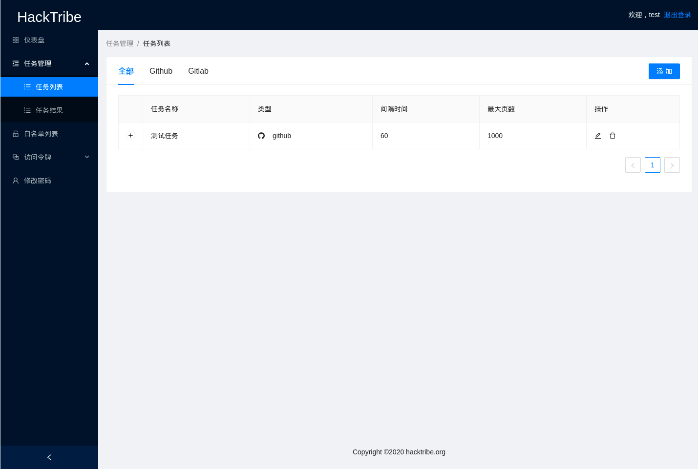
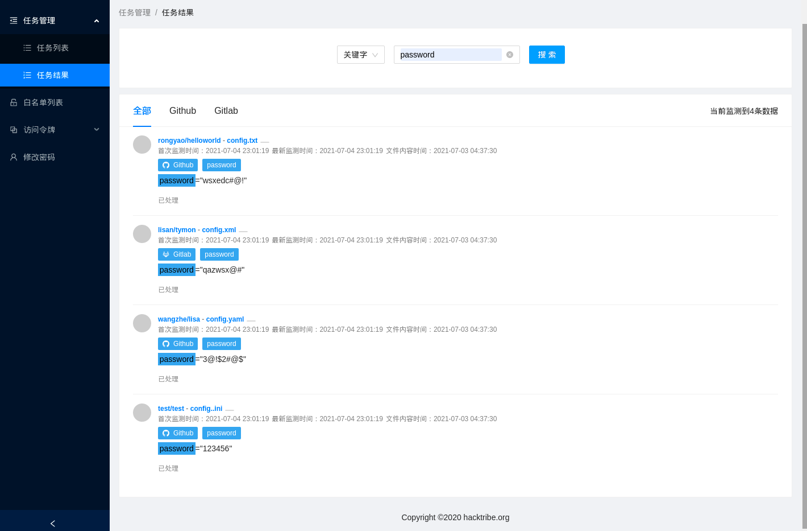
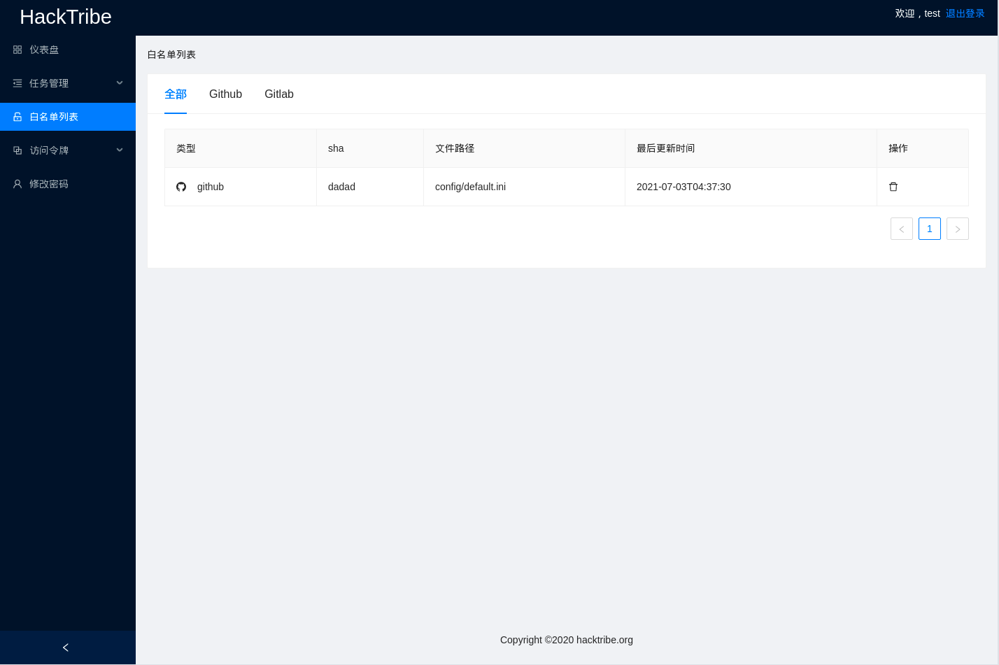
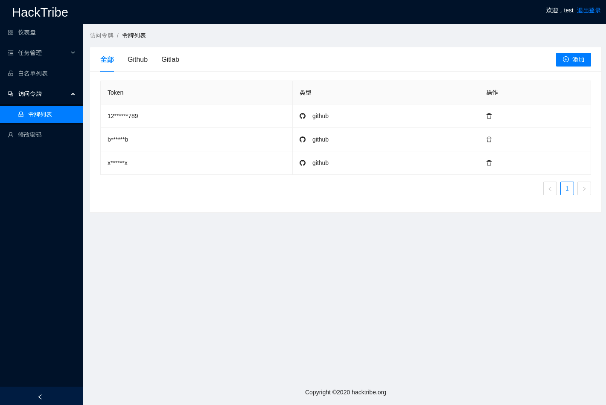

# info-leak-monitor-web
The project for info-leak-monitor-api frontend.

## Build
```shell
git clone https://github.com/HackTribe/info-leak-monitor-web.git && cd info-leak-monitor-web && yarn build
```

## Usage
You need copy `build` dir to your `web server` work dir. e.g `nginx` or `apache`.

## Screenshot






# Donate
if you think the it's helpful for you, please consider paying a cup of coffee for me. Thank you!
